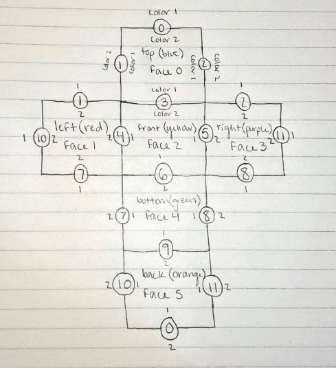
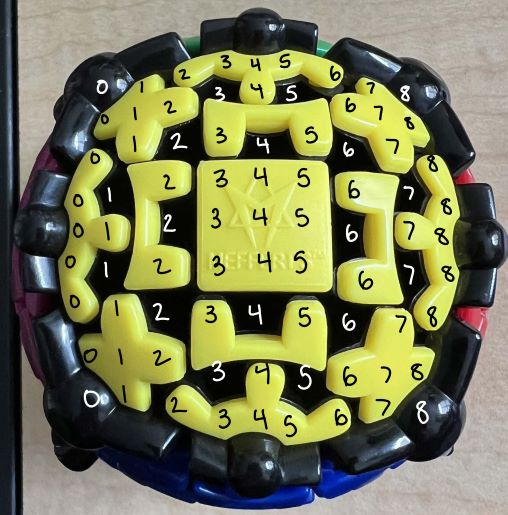

# Modeling the Gearball

## Table of Contents

[How to run the code](#how-to-run-the-code)

[Description of Data Structures](#description-of-data-structures)

[Examples of the GUI Output](#examples-of-the-gui-output)

[Description of Randomizer](#description-of-randomizer)

[Description of Heuristic](#description-of-heuristic)

[What I Learned](#what-i-learned)

[Who Did What](#who-did-what)

## How to run the code

(This code contains both the GUI and the randomize function)

To compile the program

```
g++ -o Gearball main.cpp Gear.cpp Face.cpp Gearball.cpp
```

To then run the program

```
./Gearball
```

## Description of Data Structures

To get a better understanding of how I decided to model the Gearball puzzle, I would first like to include a sketch of the model I used, which I reference throughout this file. It shows the layout of the gearball puzzle, with the faces and gears labeled, as well as the color1 and color2 for each of the gears.



I decided to represent the Gearball using three C++ classes: Gear, Face, and Gearball. These three classes work together to make a model of the entire Gearball as a whole, allowing it to move and function the same way as the actual Gearball puzzle. The description of each of these individual classes is below.

### Gear

The Gear class represents one individual gear piece within the puzzle. I decided these pieces needed their own class separate from the face class as they are the most unique of the pieces on the puzzle and they rotate when a move is done on the puzzle. The colors on one gear piece are shared between two faces, and the placement of these colors is changing constantly as the puzzle is being manipulated. Therefore, having their own class to represent them helps to keep track of these changes.

The Gear class has two char variables representing the two colors present on each gear: color1 and color2. Each gear within the puzzle has a predetermined placement of color1 and color2 in order to keep the gear organized and to properly keep track of the placement of each color as the gear rotates. For example, the gear in between the blue and yellow has a color1 of blue and a color2 of yellow. As a gear's position within the puzzle moves due to a face being rotated, the orientation of its color1 vs. color2 might change. To account for this, the Gear class contains the method switchColors(), which will reassign color1 to color2 and vice versa. So when the yellow face is rotated clockwise, the gear that used to be in between the yellow and the blue face is now in between the yellow and the purple face, and in this position its color1 should be yellow and its color2 should be blue. The orientations of the colors of all the gears can be seen in the sketch of the gearball provided. 

Finally, the Gear class contains an int variable numRotations, which keeps track of the number of times the gear has been rotated, as well as a rotate() method, which takes the direction of rotation as input and increments or decrements numRotations accordingly. For this method, it takes the direction of rotation as a bool variable, with true representing clockwise and false representing counterclockwise. This method also takes into account that six rotations of the gear in either direction brings the gear back to its starting position. So, the numRotations variable for each gear will only ever be a value within the range [-6, 6]. The combination of numRotations with the assigned color1 and color2 variables are used in the Gearball class to determine the proper orientation of each gear. 

### Face

The Face class represents each individual side of the gearball. I decided to make a class to represent each face of this puzzle to help organize this model even more and to keep track of each face.

The two main variables of the Face class are its name and faceArray. The name variable is a string variable which is assigned to each face to describe which face it is ie. "top", "front", "bottom", etc. The faceArray variable is a 9x9 2D array which represents the location of each color within the face. I decided to represent each face as a 9x9 array because that way each individual piece of each gear within the face is able to be represented. I originally was thinking of each face as a 6x6 grid, but I was struggling with being able to properly represent the exact location of each color on the gears as well as the colors of each of the other pieces. I therefore decided that a 9x9 grid worked the best to represent each face. A diagram of how the face of the gearball fits in a 9x9 grid is below.



When a Face object is initialized, the color of the face as well as a name must be provided. The provided name is assigned to the name variable, and the faceSetup() method within the class sets up the face with the provided color. This method first fills the entire faceArray with the provided color, and then it assigns blank spaces to the correct spots within the array as not every spot within the 9x9 grid is filled with a color on each face, as can be seen in the image above. 

The Face class also contains methods to support moves being done on the puzzle. When a move is done on the gearball puzzle, sections of each face are moved to another face on the puzzle. To support this functionality, the Face class contains the methods copyTopRows(), copyBottomRows(), copyLeftCols(), and copyRightCols(). These methods return a 2D char array with the corresponding rows or columns to then be used in the Gearball class to make moves on the puzzle. Another effect of a move being done on the puzzle is that some faces are rotated. To support this, the Face class contains a rotateFaceCCW() method, which rotates the faceArray by 90 degrees in the counterclockwise direction. When a face needs to be rotated in the clockwise direction instead, I simply call this method three times.

Finally, the Face class contains methods that support the printing of each face for the GUI portion of this project. These methods are printRow() and printRowBackwards(). These functions take in an int value indicating which row of the faceArray to print out and prints out that designated row, either forward or backward. The printRowBackwards() method is used only for the back (orange) face as this face is printed out rotated 180 degrees for the GUI.

### Gearball

The Gearball class is the main class for this project, representing the entirety of the gearball puzzle. This class creates both Gear and Face objects to model the entire puzzle, and it contains methods to support all of the possible moves that can be made on the puzzle.

The Gearball class contains a gears array as well as a faces array. The gears array contains 12 gears to represent each gear on the puzzle, and the faces array contains 6 faces to represent each face on the puzzle. When an object of the Gearball class is initialized, its methods initializeGears() and initializeFaces() are ran. The initializeGears() method creates 12 new Gear objects with the correct corresponding colors to represent each gear on the puzzle and assigns them to spots in the gears array. The initializeFaces() method creates 6 new Face objects with the correct color and name associated with each face on the puzzle and assigns them to spots in the faces array. Each gear and each face is therefore numbered according to its spot in its corresponding array, which is the main way they are able to be kept track of. The numbers for each gear and each face are shown on the sketch at the top of this file.

The Gearball class contains 14 methods that are used just to be able to swap rows and columns in between faces on the puzzle. This is due to the fact that the faceArray for each face represents that face as the orientation of when you are holding the puzzle and looking directly at the face. Each of these methods takes as input a Face object representing the face that the new rows or columns are going on to and a 2D char array with the values of the new rows or columns being used. For swapping between some faces, this process is as simple as swapping the top rows of one face onto the top rows of another (or left columns, bottom rows, or right columns). This is where the swapLeftCols(), swapRightCols(), swapTopRows(), and swapBottomRows() methods come in. These methods take the new columns or rows passed in and put them in the faceArray for the face passed in at the correct spots. These methods are used for swapping between the front (yellow), top (blue), and bottom (green) faces as well as between the left (red), front (yellow), right (purple), and back (orange) faces. Swapping between faces is not always as simple as this, however. Swapping sections of one face onto another may mean swapping from one orientation to another, which complicates this process quite a bit. Swapping from the red face to the blue face is a good example of this dilemna. The right columns of the red face must be swapped onto the top rows of the blue face and vice versa due to their orientations. Therefore, the simple top row to top row function will not suffice. This is where the swapLeftColsToTopRows(), swapRightColsToTopRows(), swapRightColsToBottomRows(), swapLeftColsToBottomRows(), swapTopRowsToLeftCols(), swapTopRowsToRightCols(), swapBottomRowsToRightCols(), and swapBottomRowsToLeftCols() methods come in. These methods are used to properly fix the orientation of rows and columns being swapped between the left (red), top (blue), right (purple), and bottom (green) faces. Finally, the back (orange) faces presents challenges due to the way that its faceArray represents it. The top of this face is directly next to the top of the top (blue) face, and the bottom of this face is directly next to the bottom of the bottom (green) face. Therefore, swapping columns between these faces means swapping left to right columns and right to left columns. This is where the swapRightToLeftCols() and swapLeftToRightCols() methods come in. All of these methods combined fully encapsulate every possible swapping of rows and columns between each face on the gearball puzzle.

The Gearball class also has methods to properly align each gear according to its colors, numRotations, and the face it is on. These methods are alignTopGearValues(), alignRightGearValues(), alignLeftGearValues(), and alignBottomGearValues(). Each of these functions takes in as input a Gear object representing the gear being aligned as well as a Face object representing the face that this gear is on. These functions assign the correct colors onto the correct spots of the given face's faceArray based on the given gear's numRotations variable. These functions also take into account which face the gear is being aligned on due to the differences in placement of color1 vs. color2 for each face.

The methods in this class representing each of the 6 possible moves that can be done on the gearball are rotateRightAndLeftCW(), rotateRightAndLeftCCW(), rotateTopAndBottomCW(), rotateTopAndBottomCCW(), rotateFrontAndBackCW(), and rotateFrontAndBackCCW(). Each of these methods follows the same general pattern. First, the rotate() function is called on each gear that rotates when the move is performed. Then, the gears on the faces that are rotated when the move is performed are swapped around to their new spots. If swapping the spots of these gears causes the orientation of any of the gears' colors to need to be changed, the switchColors() function is called for that gear. The rotateFaceCCW() function is also called the correct number of times (for CW vs CCW) on the faces that are being rotated in order to adjust their faceArray's accordingly. Next, the corresponding rows or columns are swapped between the faces that need to be swapped for the move that is performed, keeping in mind the complications in swapping between faces discussed above. Finally, the correct methods to align the gears are called to assign the correct values to the correct spots on the faces' faceArray's to adjust for the gears' rotations.

Finally, the main methods within the Gearball class that can actually be called on by the user are resetGearball(), printGearball(), and randomizeGearball(). The reset function resets the gears by calling on their setColor1() and setColor2() methods to reset their colors and their setNumRotations() method to reset the number of rotations for each gear to 0. The rest function resets the faces by calling on their faceSetup() functions with the correct colors to reset each face to its initial color. The print function in this class is what provides the GUI for this project. It takes into account that the top face must be printed on its own first, then the left, front, and right faces together in a line, then the bottom face, and finally the back face. Each face's printRow() method is called to print each row, except the back faces calls on its printRowBackwards() method to correctly orient this face for the GUI. The final method is the randomizeGearball() method, which is used to randomize the puzzle according to a given number of moves. This function is described in more detail in the 'Description of Randomizer' section.

### Main

The Main class contains the actual functionality of the progam, and it is where an object of the Gearball class is initialized and its methods are called on. This class contains a printMenu() function which prints out the options the program is capable of doing, which consist of quitting the program, printing the menu, printing the gearball GUI, randomizing the gearball, and resetting the gearball. The user is able to continue inputting which functionalities they would like to be done until they designate they would like the program to quit.

## Examples of the GUI Output

### In its solved state:

```
            BBBBBBB
           BBB B BBB
           BB B B BB
           B BBBBB B
           BB BBB BB
           B BBBBB B
           BB B B BB
           BBB B BBB
            BBBBBBB
 RRRRRRR    YYYYYYY    PPPPPPP
RRR R RRR  YYY Y YYY  PPP P PPP
RR R R RR  YY Y Y YY  PP P P PP
R RRRRR R  Y YYYYY Y  P PPPPP P
RR RRR RR  YY YYY YY  PP PPP PP
R RRRRR R  Y YYYYY Y  P PPPPP P
RR R R RR  YY Y Y YY  PP P P PP
RRR R RRR  YYY Y YYY  PPP P PPP
 RRRRRRR    YYYYYYY    PPPPPPP
            GGGGGGG
           GGG G GGG
           GG G G GG
           G GGGGG G
           GG GGG GG
           G GGGGG G
           GG G G GG
           GGG G GGG
            GGGGGGG
            OOOOOOO
           OOO O OOO
           OO O O OO
           O OOOOO O
           OO OOO OO
           O OOOOO O
           OO O O OO
           OOO O OOO
            OOOOOOO
```

### After 1 Move (RotateRightAndLeftCW() for this example)

```
            OBBB\OY
           OOO B YYY
           OO B B YY
           O OBBBY Y
           OO BBB YY
           O OBBBY Y
           OO B B YY
           OOO B YYY
            OY\BBBY
 RRRRRRR    BYYY\BG    PPPPPPP
RRR R RRR  BBB Y GGG  PPP P PPP
RR R R RR  BB Y Y GG  PP P P PP
R RRRRR R  B BYYYG G  P PPPPP P
RR RRR RR  BB YYY GG  PP PPP PP
R RRRRR R  B BYYYG G  P PPPPP P
RR R R RR  BB Y Y GG  PP P P PP
RRR R RRR  BBB Y GGG  PPP P PPP
 RRRRRRR    BG\YYYG    PPPPPPP
            YGGG\YO
           YYY G OOO
           YY G G OO
           Y YGGGO O
           YY GGG OO
           Y YGGGO O
           YY G G OO
           YYY G OOO
            YO\GGGO
            GOOO\GB
           GGG O BBB
           GG O O BB
           G GOOOB B
           GG OOO BB
           G GOOOB B
           GG O O BB
           GGG O BBB
            GB\OOOB
```

## Description of Randomizer

The randomizer for this project was implemented as a method within the Gearball class. This method is called randomizeGearball(), and it takes as input an integer value designating the number of moves to be made. This function uses C++'s srand() and rand() functions in order to obtain and perform the given number of random integer values from 0 to 5, denoting which of the 6 possible moves should be performed: 

Move 0 = rotateRightAndLeftCW()

Move 1 = rotateRightAndLeftCCW()

Move 2 = rotateTopAndBottomCW()

Move 3 = rotateTopAndBottomCCW()

Move 4 = rotateFrontAndBackCW()

Move 5 = rotateFrontAndBackCCW()

This randomizer function does two things to make sure it will randomize the puzzle the most efficiently. First, it will not let two moves of the same face in different directions happen in a row ie. move 0 and then move 1 or move 3 and then move 2. This is because these moves back to back will cancel each other out and leave the puzzle at exactly the same state as it was before they were performed. The function does this by keeping the previous move in memory and comparing it to the current move. If they are opposites of each other, the function will continue to find another random move until they are not. Second, this function will not let the same move be done more than 11 times in a row. This is because 12 iterations of the same move will return the puzzle to the exact same state. The function does this by keeping track of the number of same moves in a row in the numSameMoves variable. If a move is performed and the previous move was the same move, this variable is incremented. If a move is performed and the previous move was not the same move, this variable is reset to 0. If the number of same moves in a row hits 12, the function will continue to generate a new random move until it is not the same as the previous move, and will then reset the numSameMoves variable to 0.

## Description of Heuristic 
The heuristic I came up with for this puzzle is a combination of two admissible heuristics: one focused on the rotation of the gears and one focused on the colors on the faces. The maximum of these two sub-heuristics can be found and used as the heuristic for this puzzle. 

The first heuristic utilizes the gear's numRotations variable to track how many moves it would take to return the gear to its starting position. I would check each of the 12 gears on the puzzle and take the maximum value of them all as opposed to adding them up. In this program, I keep track of each gears' number of rotations on a scale from -6 to 6 (-6 to 0 being CCW rotations and 0 to 6 being CW). Therefore, the maximum number of moves it would take to return a gear back to its starting position would be 3, so this heuristic will give values in the range [0, 3]. This heuristic is admissible because, no matter what, it will always underestimate the number of moves needed to solve the puzzle. When one move is done on the puzzle, the maximum number of times a gear is rotated is 1. When a second move is done on the puzzle, it could either rotate the game gears, yielding a value of 2, or rotate different gears, making this heuristic yield a value of 1 still. Again, when a third move is done on the puzzle, it could either add 1 to the previous value if the same gears are rotated or not increase the value if different gears are rotated. The maximum value in either case for 3 moves is 3. As moves increase, it is impossible to increase the heuristic value past 3, so this heuristic will always yield a smaller value than the number of moves necessary. 

It is possible for the heuristic described to yield a value of 0 without the puzzle actually being solved if the gears are all aligned in the correct positions but the colors on the faces are not all correct. Therefore, I decided to combine this heuristic with a heuristic that pays attention to the colors on the faces of the puzzle. This heuristic consists of counting up the total number of spaces within all of the puzzle's faces' 9x9 faceArrays (not including the spaces that represent the gears) that do not match the correct color of the corresponding face and dividing that number by 96. When one move on the puzzle is done, the total number of spaces (not counting the gear spaces) that are changed in one face is 24, and that happens on four faces, so the total number of spaces affected by one move is 96, hence the denominator in this heuristic. This heuristic is admissible because the maximum number of spaces that are affected by a move on this puzzle is 96, so by dividing by that number, it is ensuring that the heuristic can never overestimate the number of moves needed to solve the puzzle. Once both of these heuristics are calculated separately for a puzzle state, the maximum of the two will be assigned as that puzzle state's heuristic value. I believe this heuristic will be reasonable to implement because I will be using the gears' numRotations variables and the faces' faceArray variables to come up with the value, so the function itself will not be too difficult to produce.

## What I learned

I learned a lot throughout the development of this project. First, this project was able to give me a quick refresh into the world of C++ development, as I have not used it for a project in quite a while. I was able to be reminded of the class and file structure within C++, which I am grateful for. A main part of this refresh for me also was in how to go about thinking about creating a class structure to fully represent the desired functionalities of this program. The most daunting part of the project was when I first started, when the possibilities of how to model the puzzle were endless. I knew I wanted to use classes within C++ to model the puzzle, but deciding on what classes were necessary was very difficult at first. Ultimately, I tried to think about how I could model the puzzle using as few classes as I could, but enough to fully separate out functionalities. My first thought was to create classes for each type of piece on the puzzle, of which there are four, as well as a face class and the gearball class. Essentially just breaking down the puzzle into each of its individual pieces and then combining them. As I thought this plan through, however, I realized that all of the pieces, besides the gears, remained pretty stagnant in relation to the faces of the puzzle as it was manipulated. Therefore, I determined that it was only necessary to create a separate class for the gear pieces. The experience in modeling this puzzle and going through this thought process was valuable for me to refresh and relearn the principles of object oriented programming within C++. 

Second, I learned that making moves on this puzzle is much more complicated than I had initially perceived. At least, being able to represent them through code within a 2 dimensional model is. When I began coding the implementations of each move, I thought it was going to be relatively straightforward: some gears rotate, some faces rotate, and some rows or columns swap between faces. This is essentially true, but as I went about writing code for the implementation of these moves, it seemed to just get more and more complicated. Trying to represent a 3D object with 6 faces that can be oriented in multiple ways and the sides manipulated in multiple directions was rather difficult. Representing each face as a 9x9 array object representing each of the colors seemed simple enough, but implementing the moves in code revealed to me how the interaction between these faces was not going to be as simple as I had thought. I already discussed above in the section about the Gearball class how each of the swap functions work. These were essentially the product of several hours of confused attempts at figuring out how the 2D representations of these faces were able to interact. Another big issue I struggled with was dealing with how I was going to represent and keep track of the two colors on each gear. Since each gear is present on two faces, keeping track of which color was on which face at any given time was very complicated and confusing for me. I eventually came up with the system I have implemented now, with the color1 and color2 model, but this was a big facet of learning for me. In the end, I learned a lot about how the gearball puzzle functions as well as how to model a 3D object onto a 2D space. 

Finally, I also learned quite a bit about heuristics, specifically admissible heuristics, and the process and techniques to come up with them for a problem. I had honestly never even heard of a heuristic in this context before this class and project, so even just learning what they were was new for me. The textbook also had very valuable information about how to generate heuristics, whether that be by looking at relaxed versions of the problem, subproblems, or a combination of techniques. Having to think through many options to come up with the best heuristic for this puzzle led to a lot of learning for me. I started by thinking solely of how I could track the gears to determine a heuristic value, but I eventually realized this could lead to the deception of a solved state without the puzzle actually being solved. I then started to look into tracking the colors on the faces of the puzzle, similar to a heuristic for a Rubiks cube, but I did not think this alone would be the best posisble heuristic as well since it was really only yielding me values between 0 and 2 in all of my testing. I then realized that by combining these two heuristics, I could create a heuristic that was overall better for this puzzle. 

## Who Did What
My programming buddy, Julia Stekardis, and I worked pretty loosely together on this project. We met up on Monday the 29th to discuss the project and how we were going to go about it. We both were pretty confused at that point about the project, but I had put slightly more thought into it at that point than she had. I had already come up with a rough idea of a class structure for the model as well as the 9x9 face array concept, which I shared with her. Again, we were both pretty lost on how to actually start implementing a model of the puzzle in code, though, so we determined that we were going to work on it slightly more separately and then meet up again to discuss further. I then tested positive the next day for covid, so we did not meet up again after that. In addition, I found out that I was going to receive an extension on the project due to having covid. Because of this, her and I determined we were going to work pretty separately and turn in separate code so she could still get her project in on time, but we could still come to each other with questions and collaborate / discuss our own implementations with each other. 